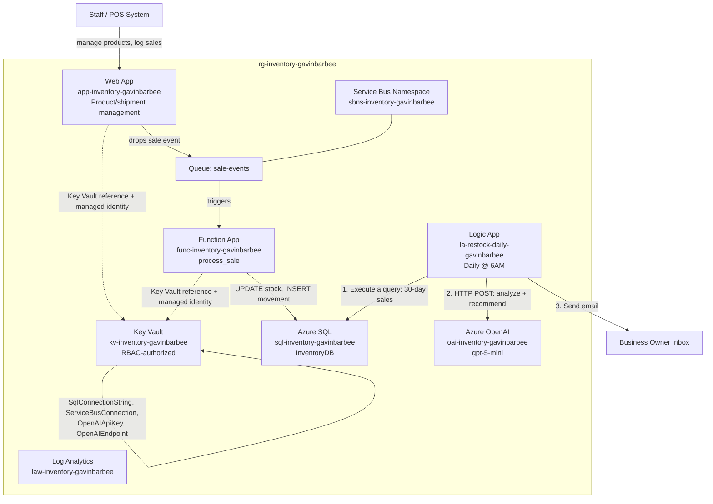
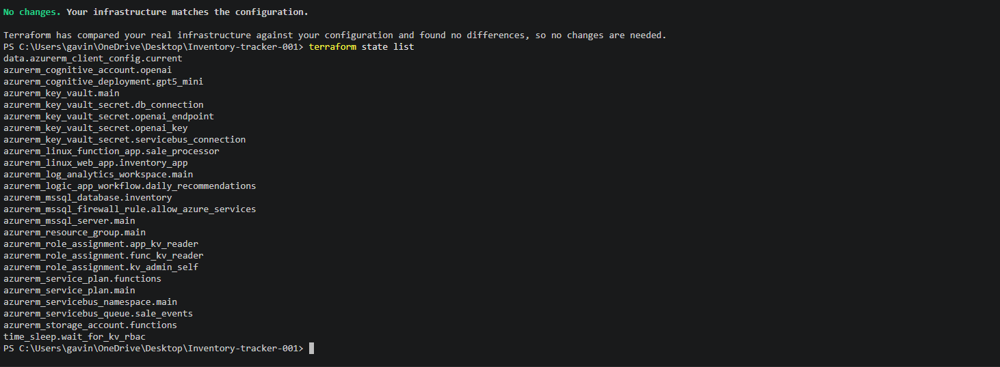
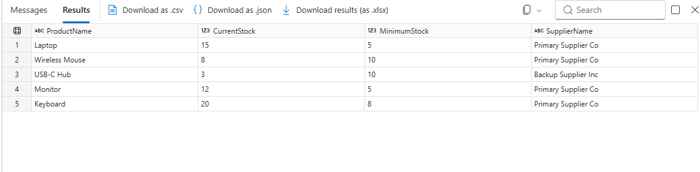
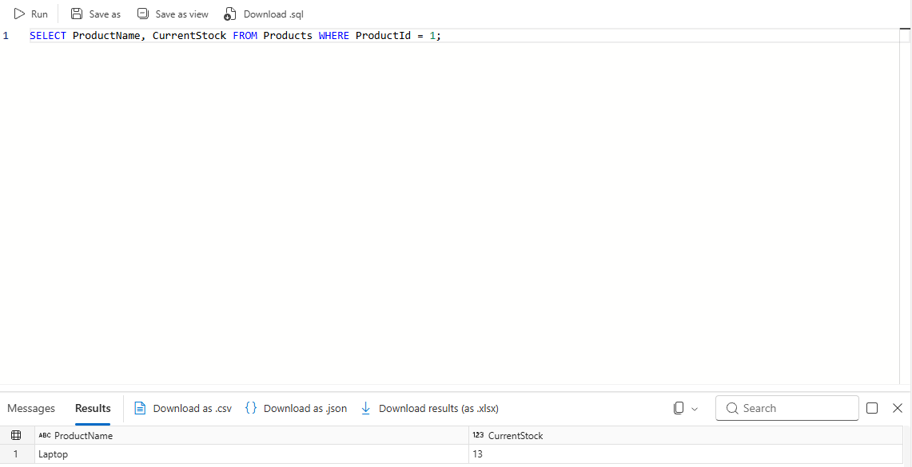
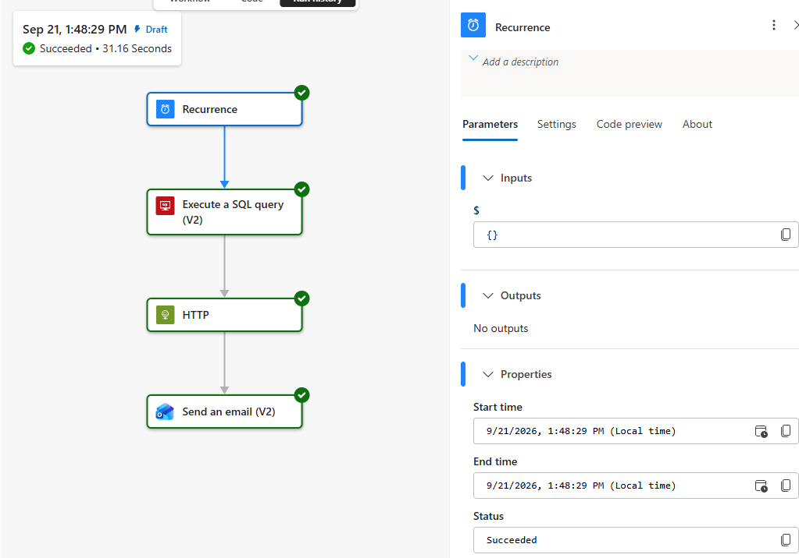
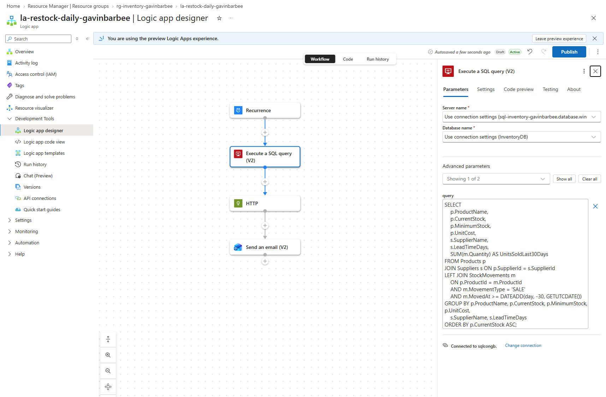
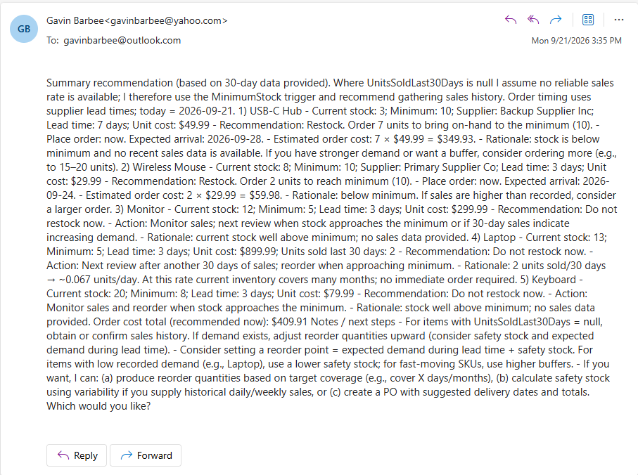
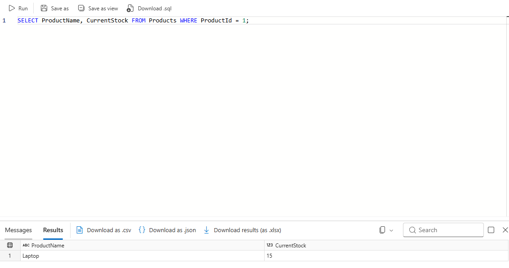

# Azure AI Inventory Tracker

**Status:** ✅ Built, deployed, and verified end-to-end — real-time stock updates, AI-generated restock recommendations, and daily email delivery are all live and confirmed working.

## 🎬 Video Walkthrough

> 📌 *Loom link coming soon — will be added here once recorded.*

[]()

---

## 📖 Project Overview

Small retailers, restaurants, and service businesses share a common and expensive problem: they either run out of what customers want most — right when demand is highest — or they tie up cash in stock that barely moves. Both problems come from the same root cause: inventory decisions based on manual counts and gut feel instead of data.

A reactive system says "you're running low on item A." A predictive system says "based on your sales patterns over the last 30 days, you'll run out of item A in about three days — order 80 units from your primary supplier by Thursday." This project builds the predictive version:

- A web application where staff manage products, log shipments, and set minimum stock levels
- Real-time stock count updates the moment a sale is processed — no end-of-day reconciliation
- Daily AI analysis of 30 days of sales patterns generating specific ordering recommendations
- Morning email delivery of those recommendations, so every day starts with a clear decision list

**Business outcome:** inventory decisions backed by actual sales data instead of gut feel — catching a stockout before it happens instead of after a customer walks away empty-handed.

### Skills Demonstrated
- Infrastructure as Code with Terraform (`azurerm` provider), including RBAC-authorized Key Vault, managed identities, and cross-resource secret references
- Azure SQL Database — schema design, firewall rules, parameterized queries
- Azure Service Bus — decoupled, at-least-once message delivery with dead-lettering
- Azure Functions — event-driven (Service Bus trigger) serverless compute
- Azure Key Vault — centralized secret storage with RBAC authorization (not access policies), consumed via Key Vault references and managed identity
- Azure OpenAI Service — model deployment and integration for a real business use case
- Logic Apps — scheduled workflow combining a SQL query, an AI call, and email delivery
- Managed identities — system-assigned identities on both the Web App and Function App, granted least-privilege Key Vault access via RBAC rather than shared secrets

---

## 🏗️ Architecture Diagram



---

## ✅ Prerequisites

**1. Azure CLI, Terraform** — already installed if you completed prior projects.

**2. Azure OpenAI access.** This isn't available by default on every subscription. Test it directly before starting:
```powershell
az group create --name rg-inventory-gavinbarbee --location "East US"
az cognitiveservices account create --name oai-test-gavinbarbee --resource-group rg-inventory-gavinbarbee --kind OpenAI --sku S0 --location "East US" --yes
```
If this succeeds, you have access — delete the test resource group (`az group delete --name rg-inventory-gavinbarbee --yes --no-wait`) and proceed; Terraform will create the real one in Step 6. If it errors asking you to apply, submit the form at https://aka.ms/oai/access — approval timing varies, and personal (non-company) subscriptions have historically seen more friction than business ones.

**3. Log in to Azure**
```powershell
az login
az account set --subscription "Azure subscription 1"
```

---

## 🏷️ Naming Conventions

All resource names use `gavinbarbee` in place of `[yourname]`.

| Resource | Naming Pattern | Example |
|---|---|---|
| Resource Group | `rg-inventory-[yourname]` | `rg-inventory-gavinbarbee` |
| Key Vault | `kv-inventory-[yourname]` | `kv-inventory-gavinbarbee` |
| SQL Server | `sql-inventory-[yourname]` | `sql-inventory-gavinbarbee` |
| SQL Database | `InventoryDB` | `InventoryDB` |
| Service Bus Namespace | `sbns-inventory-[yourname]` | `sbns-inventory-gavinbarbee` |
| Service Bus Queue | `sale-events` | `sale-events` |
| Azure OpenAI Account | `oai-inventory-[yourname]` | `oai-inventory-gavinbarbee` |
| Model Deployment | `gpt-5-mini` | `gpt-5-mini` |
| App Service Plan (web) | `asp-inventory-[yourname]` | `asp-inventory-gavinbarbee` |
| Web App | `app-inventory-[yourname]` | `app-inventory-gavinbarbee` |
| Function Storage Account | `stfninventory[yourname]` | `stfninventorygavinbarbee` |
| App Service Plan (functions) | `asp-fn-inventory-[yourname]` | `asp-fn-inventory-gavinbarbee` |
| Function App | `func-inventory-[yourname]` | `func-inventory-gavinbarbee` |
| Function Name | `process_sale` | `process_sale` |
| Logic App | `la-restock-daily-[yourname]` | `la-restock-daily-gavinbarbee` |
| Log Analytics Workspace | `law-inventory-[yourname]` | `law-inventory-gavinbarbee` |

> ⚠️ With `gavinbarbee` specifically, two of these land **exactly** at Azure's maximum length for their resource type, with zero room to spare: `kv-inventory-gavinbarbee` is 24 characters (Key Vault's hard max) and `stfninventorygavinbarbee` is also 24 characters (storage accounts' hard max, which also disallows hyphens — note this one has none). Both fit, but a longer name would not.

---

## 🪜 Project Steps

### Step 1 — Create the Project Folder and Files

The function's code and `function.json` must live inside a subfolder named after the function (`process_sale/`), not directly in `function_app/` — and the entry-point file must be named `__init__.py`, not `process_sale.py`. A prior project in this series confirmed both requirements the hard way: a flat layout or a custom filename referenced via `scriptFile` both fail to register the function, silently. `host.json` is also required at the `function_app/` root (without it, the Function App shows "Runtime version: Error").

```powershell
New-Item -ItemType Directory -Force -Path "$HOME\inventory-tracker-001\function_app\process_sale" | Out-Null
cd "$HOME\inventory-tracker-001"

New-Item -ItemType File -Force -Path @(
  "main.tf"
  "variables.tf"
  "outputs.tf"
  "terraform.tfvars"
  ".gitignore"
  "function_app\host.json"
  "function_app\requirements.txt"
  "function_app\process_sale\function.json"
  "function_app\process_sale\__init__.py"
) | Out-Null

Get-ChildItem -Recurse -File | Select-Object FullName
```

Expected structure:
```
inventory-tracker-001/
├── main.tf
├── variables.tf
├── outputs.tf
├── terraform.tfvars
├── .gitignore
└── function_app/
    ├── host.json              ← Azure Functions runtime identifier
    ├── requirements.txt       ← Python library list
    └── process_sale/          ← Subfolder named after the function
        ├── function.json      ← Service Bus trigger binding
        └── __init__.py        ← Monitoring logic (must be __init__.py)
```

---

### Step 2 — Write `variables.tf`

```hcl
variable "yourname" {
  type = string
}

variable "location" {
  type    = string
  default = "East US"
}

variable "openai_location" {
  description = "Region for the Azure OpenAI account specifically. OpenAI approval/quota can be region-specific per subscription, independent of general resource quota — this may legitimately need to differ from `location`."
  type        = string
  default     = "East US"
}

variable "sql_admin_login" {
  type    = string
  default = "sqladmin"
}

variable "sql_admin_password" {
  type      = string
  sensitive = true
}

variable "alert_email" {
  description = "Email address to receive daily restock recommendations."
  type        = string
}

variable "tags" {
  type = map(string)
  default = {
    project    = "inventory-tracker"
    managed_by = "terraform"
  }
}
```

---

### Step 3 — Write `terraform.tfvars`

```hcl
yourname           = "gavinbarbee"
location           = "West US 2"
openai_location    = "East US"
sql_admin_login    = "sqladmin"
sql_admin_password = "YourSecureP@ssw0rd!"
alert_email        = "your.email@example.com"
```

> The `location`/`openai_location` split here isn't hypothetical — it's what this build actually needed. East US had region-restricted SQL provisioning and zero App Service quota for this subscription, but was where Azure OpenAI access was actually approved. West US 2 resolved the SQL/App Service issues but didn't have OpenAI approval for this subscription. Splitting the two variables let each resource land wherever it actually works. Your own subscription may not hit either issue — but if you do, this is why the variable exists.

> ⚠️ **`sql_admin_password` is a real, plaintext database administrator credential** — not just an identifier like a subscription ID. Treat it with the same care as any production database password: never paste it, or any Terraform output that contains it, anywhere outside your local terminal and the Azure Portal. This project also has more secret-bearing values than earlier ones in this series — a SQL password, a Service Bus connection string, and an OpenAI API key all end up in Key Vault. None of them belong in a chat, a screenshot, or a commit.

Azure SQL passwords must be 8+ characters and use at least 3 of: uppercase, lowercase, numbers, symbols — and must not contain the login name.

---

### Step 4 — Write the Function Code

**`function_app/host.json`** — required at the `function_app/` root.

> **`extensionBundle` is not optional for this project, even though it's easy to miss.** For a Python Function App using the v1 folder/`function.json` model, the host doesn't compile trigger bindings itself — non-.NET languages load trigger/binding implementations (Service Bus, Blob, Queue, Event Hub, etc.) through the extension bundle declared here. Without it, only the built-in HTTP and Timer triggers work. `az functionapp function show` will still report the `serviceBusTrigger` binding as correctly configured either way — that command just reads the static `function.json` metadata from the deployed package, which says nothing about whether the host ever actually loaded a listener for it. The practical symptom: messages sit in the queue forever with Active Message Count never dropping, no errors anywhere, and a restart doesn't help, because the real problem — missing bundle config — hasn't changed.

```json
{
  "version": "2.0",
  "logging": {
    "applicationInsights": {
      "samplingSettings": {
        "isEnabled": true
      }
    }
  },
  "extensionBundle": {
    "id": "Microsoft.Azure.Functions.ExtensionBundle",
    "version": "[4.*, 5.0.0)"
  }
}
```

**`function_app/requirements.txt`**

```
pymssql==2.2.11
azure-servicebus==7.11.4
```

> **Why `pymssql` instead of `pyodbc`:** `pyodbc` needs a system-level ODBC driver manager and the Microsoft ODBC Driver for SQL Server installed in the runtime environment — a well-documented, recurring source of "driver not found" failures on Azure Functions' Linux Consumption plan. `pymssql` ships as precompiled Linux wheels with no external driver dependency, sidestepping that entire class of problem.

**`function_app/process_sale/function.json`** — the Service Bus trigger binding. `isSessionsEnabled: false` means messages are processed in arrival order without session-based grouping, correct for a simple FIFO queue.

```json
{
  "bindings": [
    {
      "name": "msg",
      "type": "serviceBusTrigger",
      "direction": "in",
      "queueName": "sale-events",
      "connection": "ServiceBusConnection",
      "isSessionsEnabled": false
    }
  ]
}
```

**`function_app/process_sale/__init__.py`** — the monitoring logic.

```python
import azure.functions as func
import pymssql
import json
import os
import logging


def main(msg: func.ServiceBusMessage):
    """
    Triggered by every message that lands in the sale-events Service Bus queue.
    Parses the sale event and decrements the product's stock count in SQL.
    If stock falls below the minimum threshold, logs a warning for the daily
    AI analysis to pick up.
    """
    sale_event = json.loads(msg.get_body().decode("utf-8"))
    product_id = sale_event.get("product_id")
    quantity = sale_event.get("quantity", 1)
    sale_id = sale_event.get("sale_id", "unknown")

    logging.info(f"Processing sale {sale_id}: {quantity}x product {product_id}")

    # SqlConnectionString is stored as server|database|user|password rather
    # than an ODBC-style string — pymssql takes these as separate arguments.
    conn_str = os.environ["SqlConnectionString"]
    server, database, user, password = conn_str.split("|")

    conn = pymssql.connect(server=server, user=user, password=password, database=database)
    cursor = conn.cursor()

    try:
        cursor.execute(
            """
            UPDATE Products
            SET CurrentStock = CurrentStock - %s,
                LastSaleDate = GETUTCDATE()
            WHERE ProductId = %s
            """,
            (quantity, product_id),
        )

        cursor.execute(
            """
            INSERT INTO StockMovements (ProductId, MovementType, Quantity, Reference, MovedAt)
            VALUES (%s, 'SALE', %s, %s, GETUTCDATE())
            """,
            (product_id, quantity, sale_id),
        )

        cursor.execute(
            """
            SELECT ProductName, CurrentStock, MinimumStock
            FROM Products
            WHERE ProductId = %s
            """,
            (product_id,),
        )
        row = cursor.fetchone()
        if row:
            product_name, current_stock, min_stock = row
            if current_stock <= min_stock:
                logging.warning(
                    f"LOW STOCK: {product_name} | Current: {current_stock} | Minimum: {min_stock}"
                )

        conn.commit()
        logging.info(f"Stock updated for product {product_id}. Sale {sale_id} processed.")

    except Exception as e:
        conn.rollback()
        logging.error(f"Failed to process sale {sale_id}: {e}")
        raise  # Re-raising causes Service Bus to retry the message

    finally:
        cursor.close()
        conn.close()
```

---

### Step 5 — Write `main.tf`

**Provider and data sources**

`purge_soft_delete_on_destroy` and `recover_soft_deleted_key_vaults` matter specifically because Key Vault names are soft-deleted, not immediately freed, when destroyed — without these flags, tearing down and rebuilding this project with the same name would fail.

```hcl
terraform {
  required_providers {
    azurerm = {
      source  = "hashicorp/azurerm"
      version = "~> 3.0"
    }
    time = {
      source  = "hashicorp/time"
      version = "~> 0.9"
    }
  }
}

provider "azurerm" {
  features {
    key_vault {
      purge_soft_delete_on_destroy    = true
      recover_soft_deleted_key_vaults = true
    }
  }
}

data "azurerm_client_config" "current" {}
```

**Resource group**

```hcl
resource "azurerm_resource_group" "main" {
  name     = "rg-inventory-${var.yourname}"
  location = var.location
  tags     = var.tags
}
```

**Key Vault**

`enable_rbac_authorization = true` means access is controlled through Azure RBAC role assignments rather than the older Key Vault access policy model — the modern, recommended approach. The `time_sleep` resource exists because RBAC role assignments can take up to a minute or two to propagate; writing a secret immediately after the role assignment is technically correct per Terraform's dependency graph, but can still hit a transient 403 if Azure's backend hasn't caught up yet.

```hcl
resource "azurerm_key_vault" "main" {
  name                        = "kv-inventory-${var.yourname}"
  location                    = var.location
  resource_group_name         = azurerm_resource_group.main.name
  tenant_id                   = data.azurerm_client_config.current.tenant_id
  sku_name                    = "standard"
  enable_rbac_authorization   = true
  soft_delete_retention_days  = 7
  tags                        = var.tags
}

resource "azurerm_role_assignment" "kv_admin_self" {
  scope                 = azurerm_key_vault.main.id
  role_definition_name  = "Key Vault Administrator"
  principal_id           = data.azurerm_client_config.current.object_id
}

resource "time_sleep" "wait_for_kv_rbac" {
  depends_on      = [azurerm_role_assignment.kv_admin_self]
  create_duration = "60s"
}
```

**Azure SQL Server and Database**

```hcl
resource "azurerm_mssql_server" "main" {
  name                          = "sql-inventory-${var.yourname}"
  resource_group_name           = azurerm_resource_group.main.name
  location                      = var.location
  version                       = "12.0"
  administrator_login           = var.sql_admin_login
  administrator_login_password  = var.sql_admin_password
  minimum_tls_version           = "1.2"
  tags                          = var.tags
}

resource "azurerm_mssql_firewall_rule" "allow_azure_services" {
  name             = "AllowAzureServices"
  server_id        = azurerm_mssql_server.main.id
  start_ip_address = "0.0.0.0"
  end_ip_address   = "0.0.0.0"
}

resource "azurerm_mssql_database" "inventory" {
  name      = "InventoryDB"
  server_id = azurerm_mssql_server.main.id
  sku_name  = "Basic"
  tags      = var.tags
}
```

`start_ip_address`/`end_ip_address` both set to `0.0.0.0` is Azure's documented special-case syntax for "allow connections from any Azure resource" — it does not mean open to the entire internet.

```hcl
resource "azurerm_key_vault_secret" "db_connection" {
  name         = "SqlConnectionString"
  key_vault_id = azurerm_key_vault.main.id
  value        = "${azurerm_mssql_server.main.fully_qualified_domain_name}|InventoryDB|${var.sql_admin_login}|${var.sql_admin_password}"
  depends_on   = [time_sleep.wait_for_kv_rbac]
}
```

**Service Bus Namespace and Queue**

`sku = "Standard"` is required — the Basic tier only supports topics, not queues. `lock_duration = "PT1M"` locks a message for 1 minute once picked up; if processing fails or crashes within that window, the lock releases and the message becomes available for retry. `max_delivery_count = 3` sends a message to the dead-letter queue after 3 failed attempts rather than retrying forever.

```hcl
resource "azurerm_servicebus_namespace" "main" {
  name                = "sbns-inventory-${var.yourname}"
  location            = var.location
  resource_group_name = azurerm_resource_group.main.name
  sku                 = "Standard"
  tags                = var.tags
}

resource "azurerm_servicebus_queue" "sale_events" {
  name                  = "sale-events"
  namespace_id          = azurerm_servicebus_namespace.main.id
  max_size_in_megabytes = 1024
  lock_duration         = "PT1M"
  max_delivery_count    = 3
}

resource "azurerm_key_vault_secret" "servicebus_connection" {
  name         = "ServiceBusConnection"
  key_vault_id = azurerm_key_vault.main.id
  value        = azurerm_servicebus_namespace.main.default_primary_connection_string
  depends_on   = [time_sleep.wait_for_kv_rbac]
}
```

**Azure OpenAI Account**

> Azure OpenAI access and quota can be approved for a subscription on a **per-region basis** — a subscription can have working access in one region and hit `SpecialFeatureOrQuotaIdRequired` in another, independent of general compute quota. This account intentionally uses its own `openai_location` variable rather than the shared `location`, so it can stay in whichever region is actually approved even if the rest of the project moves elsewhere.

```hcl
resource "azurerm_cognitive_account" "openai" {
  name                = "oai-inventory-${var.yourname}"
  location            = var.openai_location
  resource_group_name = azurerm_resource_group.main.name
  kind                = "OpenAI"
  sku_name            = "S0"

  identity {
    type = "SystemAssigned"
  }

  tags = var.tags
}

resource "azurerm_cognitive_deployment" "gpt5_mini" {
  name                 = "gpt-5-mini"
  cognitive_account_id = azurerm_cognitive_account.openai.id
  # Azure attaches this default content-filtering policy automatically even
  # when unspecified — declaring it explicitly here stops a perpetual
  # plan/apply diff where Terraform otherwise sees it as unexpected drift.
  rai_policy_name = "Microsoft.DefaultV2"

  model {
    format  = "OpenAI"
    name    = "gpt-5-mini"
    version = "2025-08-07"
  }

  scale {
    type     = "GlobalStandard"
    capacity = 10
  }
}

resource "azurerm_key_vault_secret" "openai_key" {
  name         = "OpenAIApiKey"
  key_vault_id = azurerm_key_vault.main.id
  value        = azurerm_cognitive_account.openai.primary_access_key
  depends_on   = [time_sleep.wait_for_kv_rbac]
}

resource "azurerm_key_vault_secret" "openai_endpoint" {
  name         = "OpenAIEndpoint"
  key_vault_id = azurerm_key_vault.main.id
  value        = azurerm_cognitive_account.openai.endpoint
  depends_on   = [time_sleep.wait_for_kv_rbac]
}
```

**App Service Plan and Web App**

> Using `F1` (Free tier) here rather than the more typical `B1` (Basic) — this subscription had zero available quota for dedicated/Basic-tier App Service compute in the working region, a separate quota bucket from the Consumption (Y1) tier used by the Function App below. F1 has real limitations (60 minutes of compute per day, no always-on, no custom domains) but is sufficient for this lab's internal tool. If you have Basic-tier quota available, `B1` gives a more production-realistic setup.

```hcl
resource "azurerm_service_plan" "main" {
  name                = "asp-inventory-${var.yourname}"
  resource_group_name = azurerm_resource_group.main.name
  location            = var.location
  os_type             = "Linux"
  sku_name            = "F1"
  tags                = var.tags
}

resource "azurerm_linux_web_app" "inventory_app" {
  name                = "app-inventory-${var.yourname}"
  resource_group_name = azurerm_resource_group.main.name
  location            = var.location
  service_plan_id     = azurerm_service_plan.main.id

  identity {
    type = "SystemAssigned"
  }

  site_config {
    always_on = false # F1 (Free) tier doesn't support Always On

    application_stack {
      python_version = "3.11"
    }
  }

  app_settings = {
    "KEY_VAULT_URI"        = azurerm_key_vault.main.vault_uri
    "SERVICEBUS_NAMESPACE" = azurerm_servicebus_namespace.main.name
    "SERVICEBUS_QUEUE"     = azurerm_servicebus_queue.sale_events.name
  }

  tags = var.tags
}

resource "azurerm_role_assignment" "app_kv_reader" {
  scope                 = azurerm_key_vault.main.id
  role_definition_name  = "Key Vault Secrets User"
  principal_id           = azurerm_linux_web_app.inventory_app.identity[0].principal_id
}
```

**Function App — sale event processor**

```hcl
resource "azurerm_storage_account" "functions" {
  name                     = "stfninventory${var.yourname}"
  resource_group_name      = azurerm_resource_group.main.name
  location                 = var.location
  account_tier             = "Standard"
  account_replication_type = "LRS"
  tags                     = var.tags
}

resource "azurerm_service_plan" "functions" {
  name                = "asp-fn-inventory-${var.yourname}"
  resource_group_name = azurerm_resource_group.main.name
  location            = var.location
  os_type             = "Linux"
  sku_name            = "Y1"
  tags                = var.tags
}

resource "azurerm_linux_function_app" "sale_processor" {
  name                        = "func-inventory-${var.yourname}"
  resource_group_name         = azurerm_resource_group.main.name
  location                    = var.location
  storage_account_name        = azurerm_storage_account.functions.name
  storage_account_access_key  = azurerm_storage_account.functions.primary_access_key
  service_plan_id             = azurerm_service_plan.functions.id

  site_config {
    application_stack {
      python_version = "3.10"
    }
  }

  app_settings = {
    "SqlConnectionString"      = "@Microsoft.KeyVault(VaultName=kv-inventory-${var.yourname};SecretName=SqlConnectionString)"
    "ServiceBusConnection"     = azurerm_servicebus_namespace.main.default_primary_connection_string
    "FUNCTIONS_WORKER_RUNTIME" = "python"
    # WEBSITE_RUN_FROM_PACKAGE and AzureWebJobsStorage are intentionally
    # omitted — confirmed on a prior project in this series that setting
    # WEBSITE_RUN_FROM_PACKAGE alongside a config-zip deployment (Step 9)
    # causes a 409 conflict, and that declaring AzureWebJobsStorage in
    # app_settings when storage_account_name/access_key are already set
    # above causes a plan/apply diff that never converges.
  }

  identity {
    type = "SystemAssigned"
  }

  tags = var.tags
}

resource "azurerm_role_assignment" "func_kv_reader" {
  scope                 = azurerm_key_vault.main.id
  role_definition_name  = "Key Vault Secrets User"
  principal_id           = azurerm_linux_function_app.sale_processor.identity[0].principal_id
}
```

**Logic App — daily AI analysis and email**

```hcl
resource "azurerm_logic_app_workflow" "daily_recommendations" {
  name                = "la-restock-daily-${var.yourname}"
  location            = var.location
  resource_group_name = azurerm_resource_group.main.name
  tags                = var.tags
}
```

**Log Analytics Workspace**

```hcl
resource "azurerm_log_analytics_workspace" "main" {
  name                = "law-inventory-${var.yourname}"
  location            = var.location
  resource_group_name = azurerm_resource_group.main.name
  sku                 = "PerGB2018"
  retention_in_days   = 30
  tags                = var.tags
}
```

---

### Step 6 — Write `outputs.tf`

```hcl
output "web_app_url" {
  value = "https://${azurerm_linux_web_app.inventory_app.default_hostname}"
}

output "function_app_name" {
  value = azurerm_linux_function_app.sale_processor.name
}

output "sql_server_fqdn" {
  value = azurerm_mssql_server.main.fully_qualified_domain_name
}

output "servicebus_namespace" {
  value = azurerm_servicebus_namespace.main.name
}

output "key_vault_uri" {
  value = azurerm_key_vault.main.vault_uri
}
```

---

### Step 7 — Deploy Infrastructure with Terraform

```powershell
terraform init
terraform plan
```
Expect approximately 22 resources to add. If SQL Server creation fails with a password complexity error, revisit `terraform.tfvars` — the password needs 8+ characters across at least 3 of: uppercase, lowercase, numbers, symbols.

```powershell
terraform apply
```
Type `yes` when prompted. Takes 5–8 minutes — SQL and Service Bus provisioning are the slowest parts. After completion, copy the output values (`web_app_url`, `function_app_name`, `sql_server_fqdn`).



---

### Step 8 — Create the Database Schema

In the portal, navigate to `InventoryDB` → **Query editor**, log in with your SQL admin credentials, and run in three blocks:

**Block 1 — Create tables:**
```sql
CREATE TABLE Products (
    ProductId INT IDENTITY(1,1) PRIMARY KEY,
    ProductName NVARCHAR(200) NOT NULL,
    SKU NVARCHAR(50) UNIQUE,
    CurrentStock INT DEFAULT 0,
    MinimumStock INT DEFAULT 10,
    UnitCost DECIMAL(10,2),
    SupplierId INT,
    LastSaleDate DATETIME2,
    CreatedAt DATETIME2 DEFAULT GETUTCDATE()
);

CREATE TABLE Suppliers (
    SupplierId INT IDENTITY(1,1) PRIMARY KEY,
    SupplierName NVARCHAR(200) NOT NULL,
    ContactEmail NVARCHAR(200),
    LeadTimeDays INT DEFAULT 3
);

CREATE TABLE StockMovements (
    MovementId INT IDENTITY(1,1) PRIMARY KEY,
    ProductId INT REFERENCES Products(ProductId),
    MovementType NVARCHAR(20), -- SALE | RESTOCK | ADJUSTMENT
    Quantity INT NOT NULL,
    Reference NVARCHAR(100),
    MovedAt DATETIME2 DEFAULT GETUTCDATE()
);
```

**Block 2 — Seed test data:**
```sql
INSERT INTO Suppliers (SupplierName, ContactEmail, LeadTimeDays)
VALUES ('Primary Supplier Co', 'orders@supplier.com', 3),
       ('Backup Supplier Inc', 'supply@backup.com', 7);

INSERT INTO Products (ProductName, SKU, CurrentStock, MinimumStock, UnitCost, SupplierId)
VALUES ('Laptop', 'LAP-001', 15, 5, 899.99, 1),
       ('Wireless Mouse', 'MSE-001', 8, 10, 29.99, 1),
       ('USB-C Hub', 'HUB-001', 3, 10, 49.99, 2),
       ('Monitor', 'MON-001', 12, 5, 299.99, 1),
       ('Keyboard', 'KEY-001', 20, 8, 79.99, 1);
```

**Block 3 — Verify:**
```sql
SELECT p.ProductName, p.CurrentStock, p.MinimumStock, s.SupplierName
FROM Products p
JOIN Suppliers s ON p.SupplierId = s.SupplierId;
```



---

### Step 9 — Deploy the Function Code

```powershell
cd function_app
python -m pip install -r requirements.txt --target .python_packages\lib\site-packages
```

Build the zip with Python's `zipfile` module rather than `Compress-Archive`, which writes backslash path separators that a Linux-hosted app can't parse as subdirectories (confirmed on a prior project in this series):

```powershell
python -c "
import zipfile, os
with zipfile.ZipFile('../function_deploy.zip', 'w', zipfile.ZIP_DEFLATED) as zf:
    for root, dirs, files in os.walk('.'):
        for file in files:
            filepath = os.path.join(root, file)
            arcname = os.path.relpath(filepath, '.').replace(os.sep, '/')
            zf.write(filepath, arcname)
"
cd ..
```

```powershell
az functionapp deployment source config-zip `
  --resource-group rg-inventory-gavinbarbee `
  --name func-inventory-gavinbarbee `
  --src function_deploy.zip
```
Expect JSON output with `"status": "success"` or `"complete"`. Confirm registration explicitly rather than trusting a clean exit code alone:
```powershell
az functionapp function list --resource-group rg-inventory-gavinbarbee --name func-inventory-gavinbarbee
```

---

### Step 10 — Test the Sale Event Flow

```powershell
az servicebus message send `
  --resource-group rg-inventory-gavinbarbee `
  --namespace-name sbns-inventory-gavinbarbee `
  --queue-name sale-events `
  --body '{"sale_id":"TEST-001","product_id":1,"quantity":2}'
```

Wait 30 seconds, then verify in the Query editor:
```sql
SELECT ProductName, CurrentStock FROM Products WHERE ProductId = 1;
```
The Laptop should show `CurrentStock = 13` (15 minus 2).



---

### Step 11 — Configure the Daily Recommendation Logic App

1. Navigate to `la-restock-daily-gavinbarbee` → **Logic app designer**
2. Add trigger: **Recurrence** → Daily at 6:00 AM
3. Add step: **SQL Server** → **Execute a query**, connect to your SQL server, and run:
```sql
SELECT
    p.ProductName,
    p.CurrentStock,
    p.MinimumStock,
    p.UnitCost,
    s.SupplierName,
    s.LeadTimeDays,
    SUM(m.Quantity) AS UnitsSoldLast30Days
FROM Products p
JOIN Suppliers s ON p.SupplierId = s.SupplierId
LEFT JOIN StockMovements m
    ON p.ProductId = m.ProductId
    AND m.MovementType = 'SALE'
    AND m.MovedAt >= DATEADD(day, -30, GETUTCDATE())
GROUP BY p.ProductName, p.CurrentStock, p.MinimumStock, p.UnitCost,
    s.SupplierName, s.LeadTimeDays
ORDER BY p.CurrentStock ASC;
```
4. Add step: **HTTP** — configure it exactly as follows:
   - **Method:** `POST`
   - **URI:** `<your OpenAI endpoint>openai/responses?api-version=2025-04-01-preview` (endpoint from Key Vault's `OpenAIEndpoint` secret, or the portal's Keys and Endpoint page — GPT-5-series models need the **Responses API** (`/openai/responses`), not the older Chat Completions endpoint, which has documented reliability issues for GPT-5 models)
   - **Headers:** `Content-Type: application/json` and `api-key: <your key from Key Vault's OpenAIApiKey secret, entered directly, never pasted anywhere else>`
   - **Body:**
     ```json
     {
       "model": "gpt-5-mini",
       "input": "PLACEHOLDER"
     }
     ```
     Replace `PLACEHOLDER` with this expression (via the expression editor):
     ```
     concat('You are an inventory analyst reviewing 30 days of sales data. For each product below, recommend whether to restock, how many units, and by when, considering supplier lead time. Data: ', string(body('Execute_a_SQL_query_(V2)')))
     ```
5. Add step: **Outlook.com** → **Send an email** (Office 365 Outlook needs a work/school Exchange mailbox a personal Microsoft account doesn't have — same situation as every prior project in this series). For the **Body**, use this expression rather than pulling the SQL step's output directly:
   ```
   body('HTTP')?['output'][1]?['content'][0]?['text']
   ```
   `output[0]` is the model's internal reasoning block (empty `content`, for reasoning models like GPT-5); the actual response text is `output[1]`.
6. Save

> This step is the least specified part of the entire lab — constructing a raw HTTP call to Azure OpenAI's Responses API by hand in the Logic App designer (correct endpoint, headers, JSON body shape, and pulling the actual response text out of a reasoning model's nested output structure) takes real trial and error. Budget real time for it.



The `StockMovements` audit row from the earlier test sale, confirming the full write path works:



A full run of the Logic App, all four steps succeeding end to end:



The actual restock recommendation email this pipeline produces — real AI analysis of real (if sparse, lab-scale) sales data, correctly identifying USB-C Hub and Wireless Mouse as needing immediate restock while correctly holding off on the others:


---

### Verification Checklist

- [ ] All three tables created in InventoryDB (Products, Suppliers, StockMovements)
- [ ] Test products and suppliers seeded
- [ ] Service Bus namespace and `sale-events` queue exist
- [ ] Function App `func-inventory-gavinbarbee` exists and shows Running
- [ ] Test sale event processed: Laptop stock dropped from 15 to 13
- [ ] `StockMovements` table contains a row for the test sale
- [ ] Logic App runs daily and connects to SQL
- [ ] Key Vault contains all four secrets: `SqlConnectionString`, `ServiceBusConnection`, `OpenAIApiKey`, `OpenAIEndpoint`

---

## 🛠️ Troubleshooting

Every row below reflects something actually encountered and resolved during this build — added as it comes up, not written in advance.

| Error | Cause | Resolution |
|---|---|---|
| `terraform apply` fails on three separate resources at once: SQL Server (`ProvisioningDisabled... restricted in this region`), and both App Service Plans (`Current Limit (B1 VMs): 0` / `Current Limit (Y1 VMs): 0`) | East US wasn't cooperating with this subscription for multiple resource types simultaneously — SQL Server provisioning is explicitly region-restricted, and both plan SKUs hit 0 quota | Changed `location` in `terraform.tfvars` to `"West US 2"`, which had already proven reliable for this subscription on an earlier project. One region change resolved all three |
| `terraform apply` fails creating the OpenAI model deployment: `ServiceModelDeprecated: gpt-4o-mini Version 2024-07-18 has been deprecated` | The lab's specified model version genuinely retired for new deployments (March 31, 2026) — the model landscape moved well past what the original lab document assumed | Checked currently deployable models directly: `az cognitiveservices account list-models --name <account> --resource-group <rg> -o table`. Switched to `gpt-5-mini` (version `2025-08-07`), the direct successor in the same cost/speed tier, confirmed `GenerallyAvailable` |
| `Error: Provider produced inconsistent result after apply` on the SQL Database, and `ParentResourceNotFound` creating the Service Bus queue, right after switching regions | Same transient Azure read-after-write race hit on prior projects — the parent resources (SQL Server, Service Bus namespace) were created successfully, but Terraform polled them before Azure's read path caught up | Simply retried `terraform apply` |
| `azurerm_cognitive_account.openai` fails in West US 2: `SpecialFeatureOrQuotaIdRequired... SKU 'S0' from kind 'OpenAI'` — despite OpenAI working fine in East US minutes earlier | Azure OpenAI access/quota approval can be **region-specific per subscription**, independent of general compute quota. Moving the whole project to West US 2 to fix SQL/App Service quota broke OpenAI, which was only approved in East US | Split the OpenAI account onto its own `openai_location` variable, decoupled from the shared `location` variable — each resource now lands in whichever region actually works for it |
| `azurerm_service_plan.functions` (Y1) fails: `Requested features 'Dynamic SKU, Linux Worker' not available in resource group... Please try using a different resource group or create a new one` | The resource group had been manually created and deleted once, then destroyed and recreated again by Terraform's own region-change churn — Azure's own error message pointed at the resource group's provisioning history as the actual problem | Ran `terraform destroy` (cleaning up whatever had succeeded), then `az group delete` to remove the resource group entirely, and re-ran `terraform apply` from a genuinely clean slate rather than continuing to patch a resource group with a tangled history |
| `azurerm_service_plan.main` (B1) still fails on `Current Limit (B1 VMs): 0` in West US 2, even after the region switch resolved SQL and the Y1 Functions plan | `B1` (Basic/dedicated compute) and `Y1` (Consumption) are entirely separate quota buckets — a subscription can have working Consumption quota in a region while having zero Basic-tier quota in that same region | Switched the web app's plan from `B1` to `F1` (Free tier), which draws from a different, more available quota pool. Real limitation (60 min/day compute, no always-on) but sufficient for this lab |
| OpenAI deployment fails: `InvalidResourceProperties: The specified SKU 'Standard' of account deployment is not supported by the model 'gpt-5-mini'` | GPT-5-series models require the `GlobalStandard` deployment type — the older regional `Standard` type doesn't support them at all as of an August 2026 platform update | Changed `scale.type` from `"Standard"` to `"GlobalStandard"` in the `azurerm_cognitive_deployment` resource |
| `terraform apply` fails: `always_on cannot be set to true when using Free, F1, D1 Sku` | Switching the web app's plan to `F1` (to work around the B1 quota gap above) surfaced a real constraint — Azure's Free/F1/D1 tiers don't support Always On, and the provider defaults `always_on` to `true` when left unset | Explicitly set `always_on = false` in the web app's `site_config` block |
| Portal's Query editor: "Your IP address isn't allowed to access this server" | The `AllowAzureServices` firewall rule only permits Azure-internal service traffic — it doesn't cover a personal IP connecting through the portal's own Query editor session | Clicked the portal's own "Allowlist IP [address] on server..." button, waited ~1-2 minutes for propagation, reconnected |
| `az servicebus message send` — command doesn't exist | Service Bus data-plane operations (sending/receiving actual messages) aren't exposed through the Azure CLI at all — another inaccuracy in the original lab document | Sent the test message via the `azure-servicebus` Python SDK directly instead (already a project dependency). Authenticated via a scoped **Service Bus Data Sender** RBAC role assignment rather than a connection string — no secrets involved |
| Test message sent successfully, but stock count never updates — Service Bus queue shows Active Message Count staying at 1 forever, Dead-letter count 0, no errors anywhere, and a Function App restart doesn't help | `host.json` had no `extensionBundle` declared. For a Python Function App using the v1 folder/`function.json` model, the host only loads non-HTTP/Timer trigger bindings (Service Bus, Blob, Queue, etc.) through the extension bundle — without it, the Service Bus listener never actually starts, even though `az functionapp function show` reports the binding as correctly configured (that command only reads static deployed metadata, not runtime listener state) | Added `"extensionBundle": {"id": "Microsoft.Azure.Functions.ExtensionBundle", "version": "[4.*, 5.0.0)"}` to `host.json`, rebuilt the zip, and redeployed |

The actual symptom, caught mid-bug — same query as Step 10, run *before* the `extensionBundle` fix, minutes after the test message was sent. Stock is still 15, not 13 — the message was sitting untouched in the queue this whole time, with nothing anywhere indicating why:



| HTTP action's URI field rejects the value with "Enter a valid URI" | The URI held only the relative path (`openai/responses?api-version=...`) with no domain — the HTTP action needs a complete, absolute URL | Prepended the actual OpenAI endpoint: `https://oai-inventory-gavinbarbee.openai.azure.com/openai/responses?api-version=2025-04-01-preview` |
| Same HTTP call still fails after fixing the URI | The `Content-Type` header value had been typed as `application\json` (backslash) instead of `application/json` (forward slash) | Corrected the header value |
| Initial `/openai/responses` call with `api-version=2025-11-15-preview` returns 404 | That specific preview version isn't valid/enabled on this resource — confirmed by testing multiple versions directly via a standalone script before touching the Logic App | Used `api-version=2025-04-01-preview` instead, confirmed working via direct API test first |
| `azurerm_cognitive_deployment` fails: `InvalidResourceProperties: The specified SKU 'Standard' ... is not supported by the model 'gpt-5-mini'` | GPT-5-series models require the `GlobalStandard` deployment type — the older regional `Standard` type doesn't support them at all | Changed `scale.type` from `"Standard"` to `"GlobalStandard"` |
| Logic App runs successfully and sends an email, but the email body is the raw SQL query results, not the AI's recommendation | The Send Email step's Body field was still wired to `body('Execute_a_SQL_query_(V2)')` instead of the HTTP step's response | Changed Body to `body('HTTP')?['output'][1]?['content'][0]?['text']` |
| That expression fails: `array index '0' cannot be selected from empty array` (before finding the fix above) | Reasoning models like GPT-5 include an internal reasoning block as `output[0]` (empty `content`) — the actual message text is `output[1]` | Checked the HTTP step's actual raw response in Run History rather than guessing further, confirmed the real structure, used `output[1]` |

---

## 🧹 Cleanup

```powershell
terraform destroy
```
Type `yes` when prompted. All resources will be deleted. This project has a real, non-trivial cost footprint while running (Azure SQL, Service Bus Standard, and Azure OpenAI are not near-zero-cost services the way earlier projects in this series were) — tear it down when you're done rather than leaving it up indefinitely.

---

## 💡 Key Takeaways

- Azure quota isn't one number — it's dozens of independent buckets, and this project hit four different ones in a single deployment. SQL Server provisioning, App Service Basic tier, App Service Consumption tier, and Azure OpenAI access all turned out to be approved or restricted *independently*, sometimes in opposite directions in the same region. The fix was never "find the one region that works" — it was recognizing that different resource types legitimately need different regions, and building the Terraform to support that (a dedicated `openai_location` variable) rather than fighting a single shared value.
- AI infrastructure moves fast enough that documentation goes stale within months, not years. The lab's specified model was deprecated for new deployments, its replacement needed a different deployment SKU type entirely (`GlobalStandard`, not `Standard`), and the "obvious" API endpoint (Chat Completions) turned out to be the wrong one for a reasoning model — the newer Responses API was both the correct and the actually-reliable choice. None of this was discoverable by reading — it required querying the live account for what it actually supported and testing the real request before wiring it into anything else.
- The hardest bug in this build was invisible by design, not by accident. A missing `extensionBundle` in `host.json` meant the Service Bus trigger never loaded — but every surface-level check (the CLI reporting the binding as configured, a clean deploy, a restart) said everything was fine, because none of those checks actually confirm a listener is running. The only way to know for certain was checking the queue's own message count directly. The lesson: a resource *looking* configured and a resource *actually working* are checked by different means, and it's worth knowing which one any given verification step actually proves.
- Real security architecture is quietly more work than a shared secret, and it shows. Every credential in this project — the SQL password, the Service Bus connection string, the OpenAI key — lives in Key Vault behind RBAC, and both compute resources reach it through their own system-assigned managed identity rather than a copied connection string. That's meaningfully more moving parts (role assignments, propagation delays, `time_sleep` buffers) than just embedding secrets directly — and also exactly the pattern a real production system should use.

---

**Author:** Gavin Barbee | **Project:** Azure AI Inventory Tracker | **Difficulty:** Intermediate | **Time to Complete:** ~6–7 hours